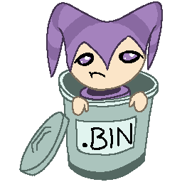
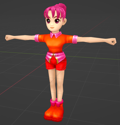
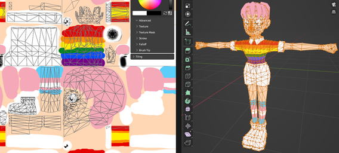
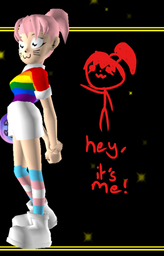

# NiGHTS into BINs...


A port of Warden's [NightsImageTool](https://github.com/mg35/NightsImageTool)

Exports a lot of Models and Textures from the game
Imports replacement Textures into the game for 8-bit encoded textures
Models do not have skeletons or animations
I'm bad at describing things 😦

## Usage

### File extraction

#### Extract one
`./nights_into_bins <binary_file>` will try to extract the textures and models into `./out/<binary_file>/`

#### Extract all

`./nights_into_bins <binary_file_directory>` will try to extract the textures and models for each binary file in the binary file directory into `./out/<binary_file>/`.


### Texture replacement

`./nights_into_bins <binary_file_directory> <texture_replacement_file_directory>` will copy, replace textures, and write modified binary files into `./in/nights.test.nightsintobins/Redirector/afs`.

Replacement textures must be the same size as the original texture.
The original texture must have had 8-bit encoding (more than 16 colors). Replacement texture must have <= 256 colors.

`./in/nights.test.nightsintobins/` can then be copied into your `Reloaded-II/Mods/` directory.

To start fresh, delete the `./in/nights.test.nightsintobins/Redirector/` directory.

---

## Low Effort Reskin Example

### Export Claris and her Hair

Open PowerShell in the directory with the nights_into_bins executable.

Run:
```
./nights_into_bins "C:/Program Files/Steam/steamapps/common/NiGHTS Into Dreams/afs/DATCLARIS.BIN"
./nights_into_bins "C:/Program Files/Steam/steamapps/common/NiGHTS Into Dreams/afs/DATCLARIS_HAIR.BIN"
```
Or run (this will take a LOT longer):
```
./nights_into_bins "C:/Program Files/Steam/steamapps/common/NiGHTS Into Dreams/afs/"
```

This will output:
```
./out/DATCLARIS/
- DATCLARIS-0.png
- DATCLARIS-1.png
- DATCLARIS.mtl
- DATCLARIS.obj

./out/DATCLARIS_HAIR/
- DATCLARIS_HAIR-0.png
- DATCLARIS_HAIR.mtl
- DATCLARIS_HAIR.obj
```
### Import the models into a model editor, or the images into an image editor:



### Edit the textures:



### Export the edited textures to an empty texture directory.
In this example, `./replacements`. The textures can also be nested in subdirectories, or not, its up to you.

```
./replacements:
- DATCLARIS-0.png
- DATCLARIS-1.png
- DATCLARIS_HAIR-0.png
```

### Reduce number of colors down to 256.
For example using [ImageMagick](https://imagemagick.org/):
```
magick mogrify -colors 256 ./replacements/*.png
```

### Import the replacements:
```
./nights_into_bins "C:/Program Files/Steam/steamapps/common/NiGHTS Into Dreams/afs/" "./replacements"
```

This will output:
```
./in/
- nights.test.nightsintobins/
  - Redirector/
    - afs/
      - DATCLARIS.BIN
      - DATCLARIS_HAIR.BIN
```

### Copy `./in/nights.test.nightsintobins/` into your `Reloaded-II/Mods/` directory.
You will also want the `ModConfig.json` file, download it from this repository at `./in/nights.test.nightsintobins/ModConfig.json` and move it into the `nights.test.nightsintobins/` directory.

### Enable the "NiGHTS into BINs" mod and launch the game.



### Cleanup.
Delete the `./in/nights.test.nightsintobins/Redirector/` directory. Delete the `./replacements` directory. Having the `./out/` directory is useful if you want to replace other textures in the future.

### ~~Spam.~~
~~Everyone on the Discord or GameBanana wants to see your character Grelliot that is totally not Elliot you hue shifted his hair green.~~
